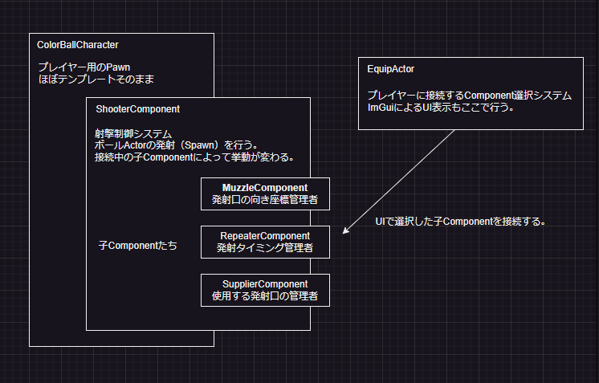

# ColorBall

ColorBallは、UE5上で射撃物の検証・流用を目的としたテストプログラムです。

## 動作環境
- Unreal Engine 5.5.4
- VisualStudio 2022

### 外部ライブラリ

- [Unreal ImGuiプラグイン (benui-dev/UnrealImGui)：MIT License](https://github.com/benui-dev/UnrealImGui)  
  Unreal Engine 5 向けに Dear ImGui を統合するプラグイン。ImPlotなどの拡張にも対応。

- [Dear ImGui (Omar Cornut)：MIT License](https://github.com/ocornut/imgui)  
  軽量で移植性の高いGUIライブラリ。Unreal ImGuiはこのライブラリをUnreal Engineに対応させたもの。

## 構成

### 主要クラス

- [ColorBallCharacter](https://github.com/7jibi8rm/ColorBall/blob/master/Source/ColorBall/ColorBallCharacter.h) 
ゲーム内でプレイヤーが操作するキャラクタークラスです。 
移動やジャンプ、装備の操作、発射アクションなど、プレイヤーの基本的な挙動を管理します。 
各種コンポーネント（ShooterComponent等）を保持し、ゲームプレイの中心的な役割を担います。 

- [EquipActor](https://github.com/7jibi8rm/ColorBall/blob/master/Source/ColorBall/Public/EquipActor.h) 
キャラクターが装備できるコンポーネントやマテリアルの管理クラスです。 
キー入力で定義されたアイテムを選択し、取り出すことが出来ます。 
ImGuiによりUI表示します。 

- [ShooterComponent](https://github.com/7jibi8rm/ColorBall/blob/master/Source/ColorBall/Public/ShooterComponent.h) 
ボールの発射処理（Spawn）を担うクラスです。接続された子コンポーネントによってボールの挙動が変わります。 

- [MuzzleComponent](https://github.com/7jibi8rm/ColorBall/blob/master/Source/ColorBall/Public/Muzzle/MuzzleComponent.h) 
発射口を表現する基底コンポーネントです。ボールの発射位置・方向を管理し、複数の発射口を持つ装備にも対応します。 

- [RepeaterComponent](https://github.com/7jibi8rm/ColorBall/blob/master/Source/ColorBall/Public/Repeater/RepeaterComponent.h) 
連射やバースト発射など、一定間隔で複数回発射する機能を提供する基底コンポーネントです。 

- [SupplierComponent](https://github.com/7jibi8rm/ColorBall/blob/master/Source/ColorBall/Public/Supplier/SupplierComponent.h) 
発射口の選択や発射順序など、発射ロジックを柔軟に制御するための基底コンポーネントです。 

## ライセンス
This project is licensed under the MIT License. See the LICENSE file for details.
