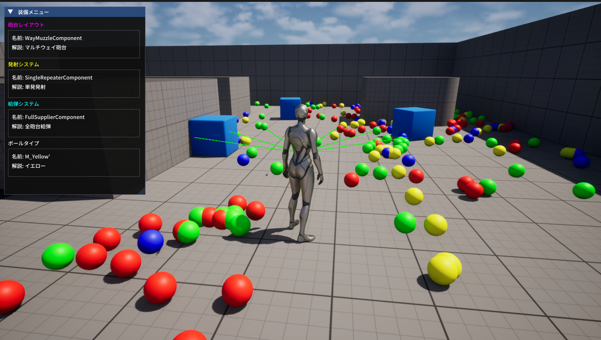

# ColorBall

ColorBallは、UE5上で射撃物の検証・流用を目的としたテストプログラムです。

## 動作環境
- Unreal Engine 5.5.4
- VisualStudio 2022

### 外部ライブラリ

- [Unreal ImGuiプラグイン (benui-dev/UnrealImGui)：MIT License](https://github.com/benui-dev/UnrealImGui)  
  Unreal Engine 5 向けに Dear ImGui を統合するプラグイン。ImPlotなどの拡張にも対応。

- [Dear ImGui (Omar Cornut)：MIT License](https://github.com/ocornut/imgui)  
  軽量で移植性の高いGUIライブラリ。Unreal ImGuiはこのライブラリをUnreal Engineに対応させたもの。

## プロジェクト構成

## 射撃システムの仕組み

## ライセンス
This project is licensed under the MIT License. See the LICENSE file for details.
